# StreamReach: from streams to systems

**Live demo:** https://streamreach-health.vercel.app (sign in with a one-click demo account) · **CDS Hooks discovery:** https://streamreach-health.vercel.app/cds-services · **FHIR:** https://streamreach-health.vercel.app/fhir/metadata

**One Health early warning for urban streams.** Citizen stream checks and the 7-day weather forecast become explainable
FHIR risk assessments for waterborne pathogens, toxic algae and mosquito-borne disease. They reach public health teams on
a map, and GPs **inside their EHR through CDS Hooks**. GP feedback flows back into the stream's risk. An **AI duty
officer** (Claude) turns the evidence into a response plan with a resident advisory in the local language, which a
human approves before it is published as FHIR.

IEEE OneAquaHealth Global Hackathon 2026 · **Track 6 Resilience Informatics** (primary) + **Track 7 Digital Health
Standards**, with Track 1 (citizen UX) and Track 4 (plain-language advice) elements.

---

## Screenshots

**Monitoring dashboard.** A satellite map with each stream's risk zone, a 14-day risk and rain chart, a day-by-day
forecast strip, what-if scenarios, live weather and the latest citizen checks.
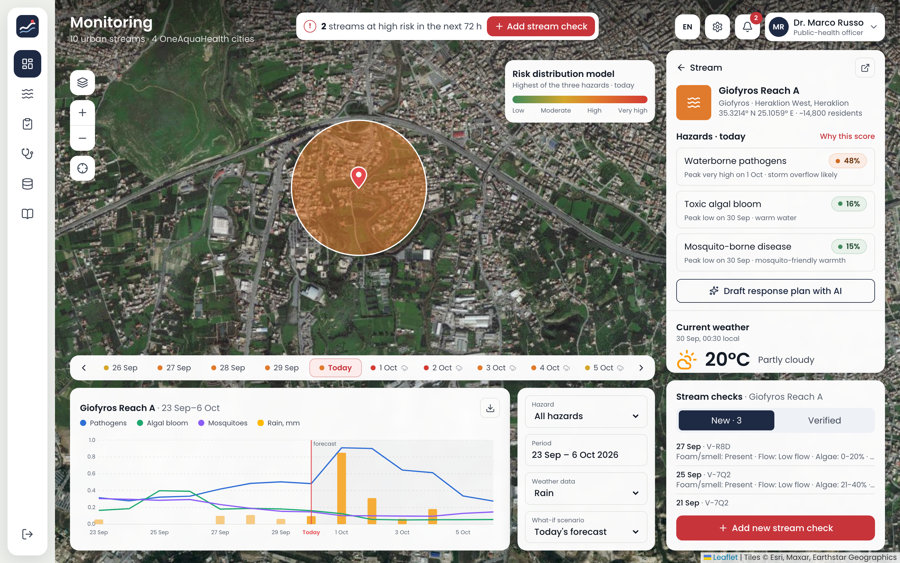

**Landing page and sign-in.** One-click demo accounts for each role.
<p>
  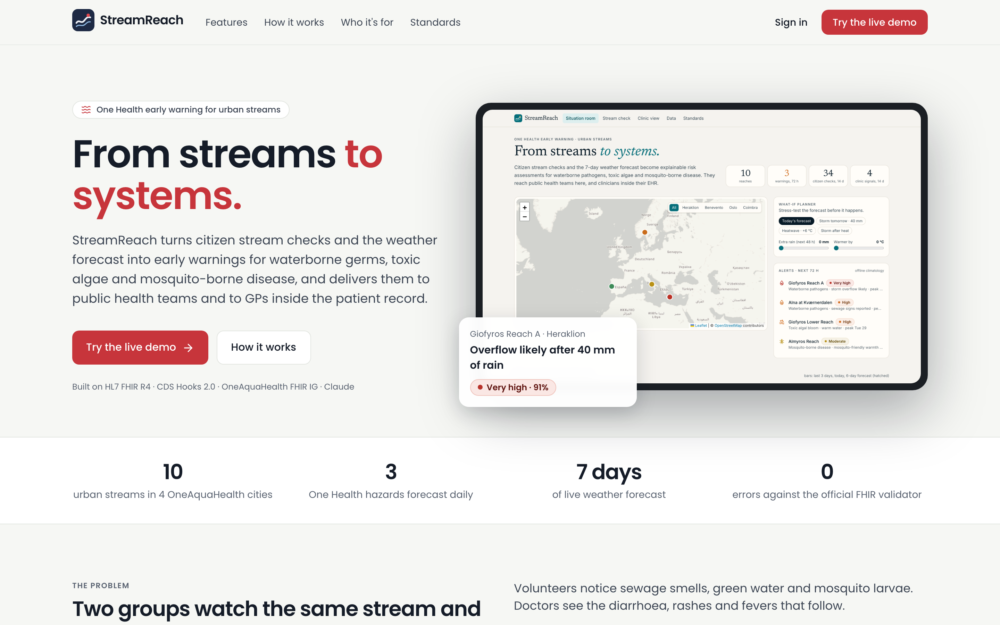
  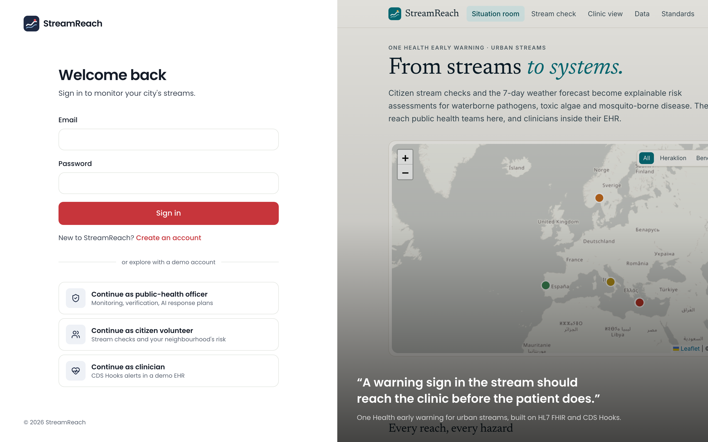
</p>

**What-if: storm tomorrow (+40 mm).** Overflow warnings across cities.
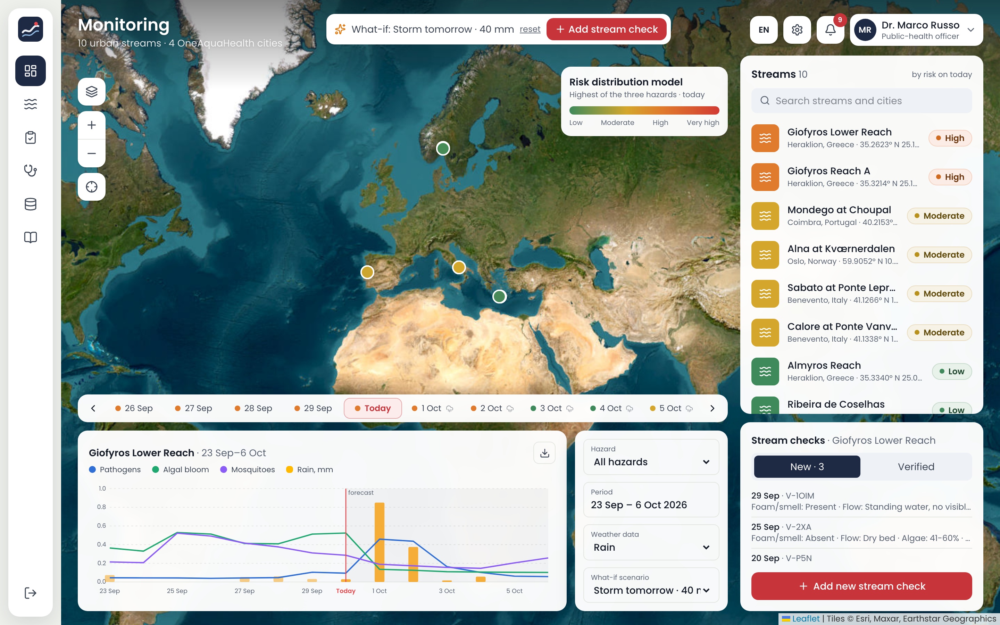

**Stream health record.** A daily risk timeline, with every factor named, sourced and weighted.
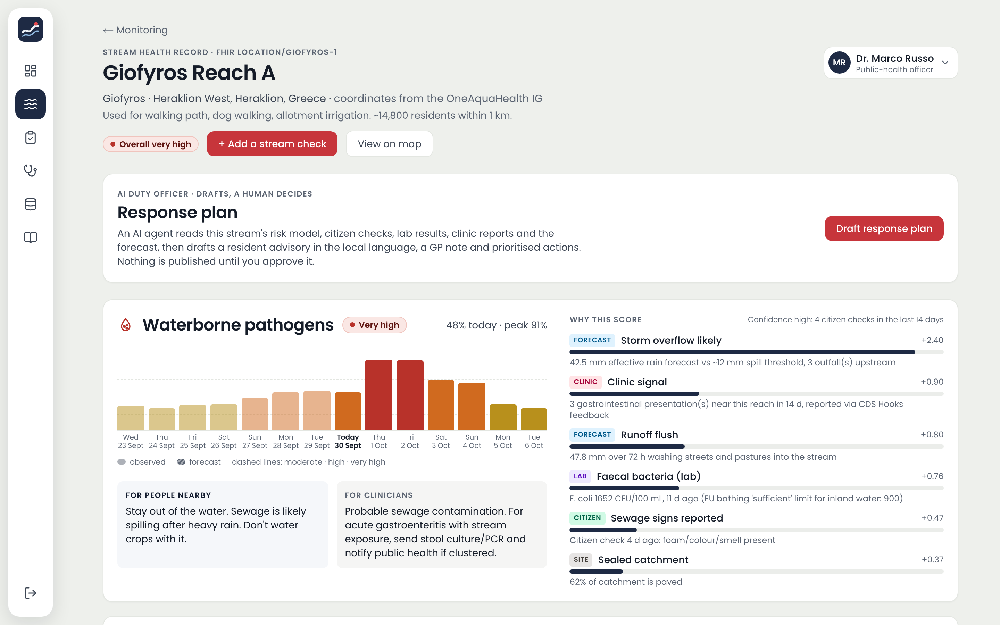

**AI duty officer.** The agent gathers evidence with tools, then drafts a plan: a local-language advisory, a GP note, owned
actions and cited evidence. The signed-in officer approves it before it is published.
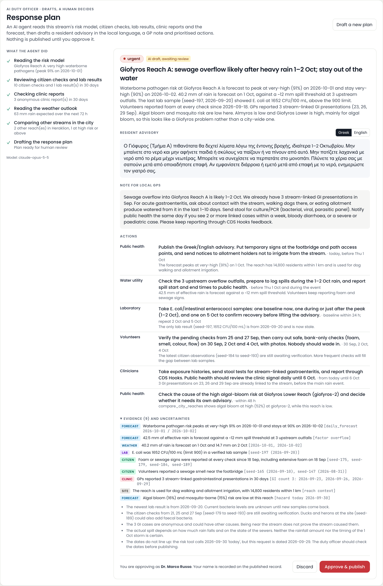

**Clinic view.** A demo EHR receiving a real CDS Hooks card, with a draft order and anonymous feedback.
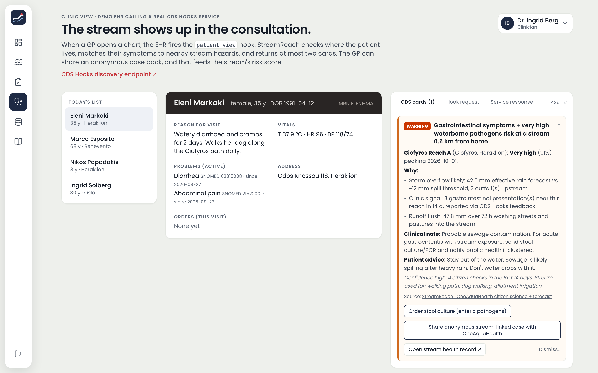

**Citizen stream check.** Five plain-language questions based on OneAquaHealth indicators.
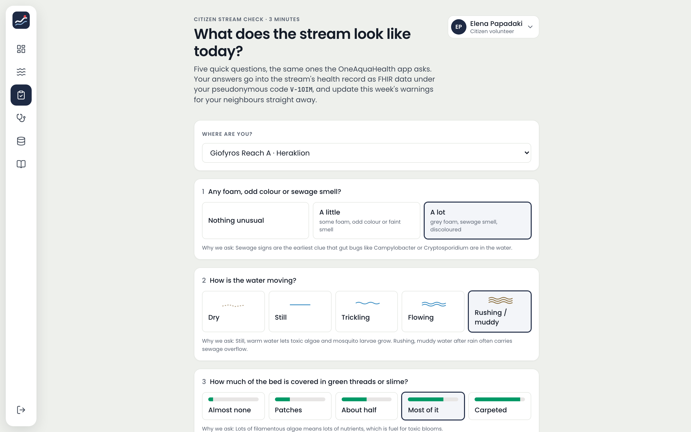

**Data explorer.** The full record, with a coordinator verification queue.
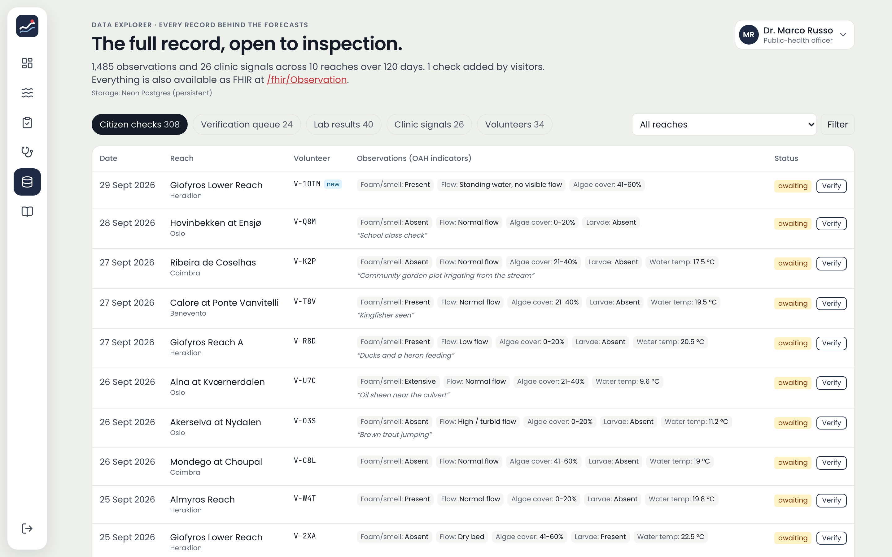

<p>
  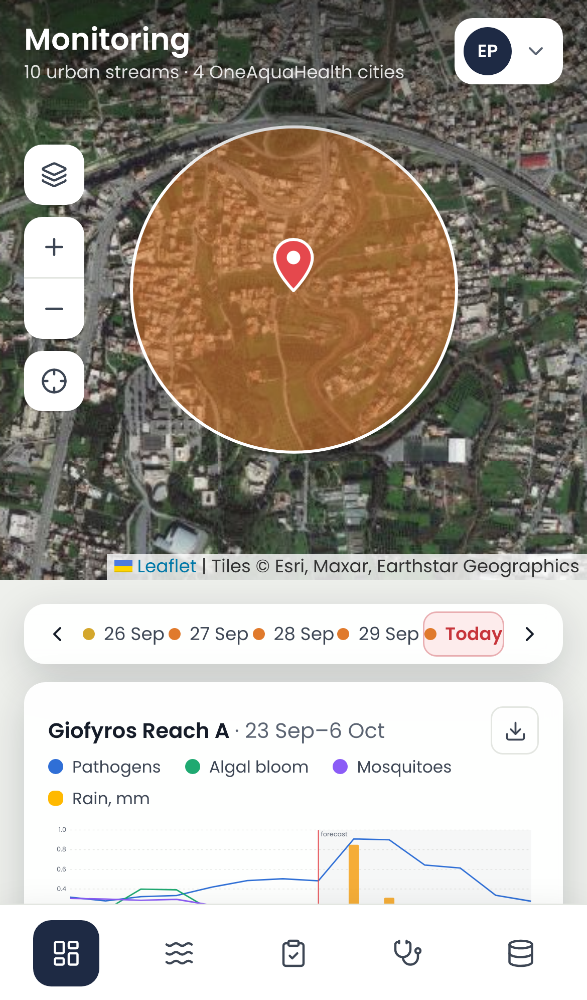
  &nbsp;
  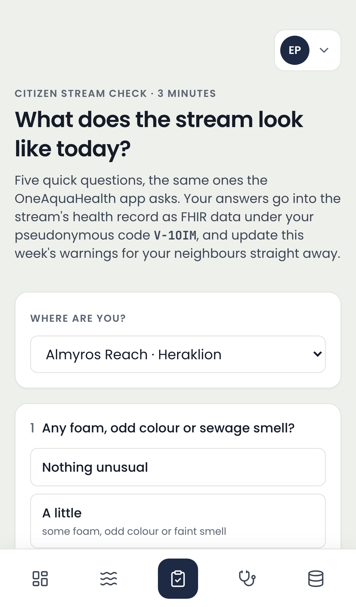
</p>

## The problem

Citizen scientists already watch urban streams: foam and sewage smell, still green water, mosquito larvae. Clinicians
already see the consequences: diarrhoea after a storm, a rash after a paddle, a fever in September. **The two never
meet.** The observation stays in an app, and the GP never learns that the patient's dog-walking path runs along a stream
that overflowed last night.

## What StreamReach does

1. **Stream check (citizen).** A 3-minute, 5-question check using the OneAquaHealth app's own indicators. It is saved as
   a FHIR transaction of **OAH-profiled Observations** and updates the neighbourhood's warnings immediately.
2. **Forecast-driven risk (public health).** For every reach, three explainable models combine the live Open-Meteo
   forecast, citizen checks, lab results and site vulnerability. Each gives a daily risk for the next 6 days with the
   factors behind it. A **what-if planner** stress-tests storms and heatwaves.
3. **Stream to clinic (CDS Hooks).** When a GP opens a chart, the EHR calls our `patient-view` service. StreamReach
   locates the patient, matches their active problems (SNOMED CT) to nearby stream hazards, and returns **at most two
   cards**. Cards carry the reasoning, a draft stool-culture order (LOINC 625-4) and patient advice. With no relevant
   risk, it returns nothing.
4. **Clinic to stream (feedback).** The GP can share an *anonymous* stream-linked case. The CDS Hooks feedback endpoint
   records it as an **OAH health-measure Observation**, which raises the reach's waterborne score. The One Health loop is
   closed.
5. **AI duty officer (agent + human in the loop).** On any stream record, *Draft response plan* runs a Claude Opus 5.5
   agent with five read-only tools:
   - the risk model;
   - recent citizen and lab observations;
   - clinic signals;
   - the weather outlook;
   - other reaches in the city.

   It streams each step to the page, then submits a strictly validated plan:
   - a resident advisory in the reach's local language (Greek, Italian, Norwegian or Portuguese) plus English;
   - a GP note;
   - up to six owned, time-bound actions;
   - evidence citing observation ids and model factors;
   - stated uncertainties.

   Nothing is public until a named duty officer approves it. It is then published as a FHIR **Communication** to the
   exposed cohort, with a **Provenance** recording the AI as author and the human as verifier.

## Why it matters

| Criterion | How StreamReach answers it |
|---|---|
| Impact & OneAquaHealth mission | Links ecosystem signals to human health outcomes in both directions: early detection of environmental risk, as the project aims for. |
| Innovation | First bridge from citizen stream science into the clinical workflow via CDS Hooks. Forecast-driven rather than retrospective. An AI agent grounded in the project's own data drafts multilingual responses, and a human stays accountable. |
| Architecture | Standards end to end: OAH FHIR IG profiles, FHIR RiskAssessment with structured factor extensions, CDS Hooks 2.0 (discovery, prefetch, fhirServer fallback, suggestions, override reasons, feedback). |
| UX | 3-minute citizen check with "why we ask" explanations; plain-language advice for residents; two-card cap to avoid alert fatigue for GPs. |
| Scale | Any FHIR R4 server can store it, any CDS Hooks-capable EHR can consume it, and any city with citizen checks and a weather forecast can deploy it. No proprietary data. |

## Run it

```bash
npm install
npm run dev        # http://localhost:3000
npm test           # 13 unit tests: risk engine, FHIR facade, CDS Hooks (+1 live agent test when ANTHROPIC_API_KEY is set)
npm run e2e        # 83 Playwright end-to-end + axe accessibility tests (local build, in-memory store, mock agent)
npm run e2e:prod   # the same suite against the live deployment; rows it creates are removed afterwards
```

The E2E suite covers:
- landing, sign-up, sign-in, sign-out, demo access, protected routes and role restrictions;
- every page and all 10 stream records, with no console errors;
- the monitoring dashboard: map markers, search, stream detail, day strip, selectors, CSV export and what-if scenarios;
- the full citizen check → stream record → coordinator verification → FHIR tag flow;
- the clinic view: cards, draft order, anonymous share landing in the data explorer, dismiss with reason, and a failing
  CDS service;
- the AI duty officer: live trace, plan, approve → FHIR Communication + Provenance, discard, double-decision guard;
- the data explorer's tabs, filters and pagination;
- the FHIR and CDS Hooks APIs, including error paths and CORS;
- phone layouts;
- a WCAG 2 AA scan with axe.

Without `DATABASE_URL` the app runs on an in-memory store. With it (Neon Postgres, provisioned through the Vercel
Marketplace), everything persists. Run `vercel env pull .env.local` to use the same database locally.

The AI duty officer needs `ANTHROPIC_API_KEY`. Without it the panel explains that the agent isn't configured.
`STREAMREACH_AGENT_MOCK=1` runs a deterministic stand-in that uses the real tools but no model, which is how the E2E
suite tests the flow. Usage guards on the live agent:
- a 15-second cooldown per visitor;
- a daily cap (`STREAMREACH_AGENT_DAILY_CAP`, default 200);
- a draft is reused for an hour unless the officer asks for a new one.

No other keys are needed. Weather comes live from [Open-Meteo](https://open-meteo.com) and falls back to a deterministic
climatology offline.

| Page | What to look at |
|---|---|
| `/` | Landing page |
| `/signin` | Sign in, or one click into a demo account: **public-health officer**, **citizen volunteer** or **clinician** |
| `/app` | Monitoring dashboard: satellite map, stream list and detail, day strip, risk/rain chart, what-if scenarios, live weather |
| `/app/streams/giofyros-1` | Stream health record: daily risk timeline, *why this score*, AI duty officer (*Draft response plan*), citizen and lab record, FHIR JSON |
| `/app/check` | Citizen stream check: shows the FHIR bundle, then the before/after risk |
| `/app/clinic` | Demo EHR calling the real CDS Hooks service: accept or dismiss suggestions and watch the feedback land |
| `/app/data` | Data explorer: every citizen check, lab result, clinic signal and volunteer, plus a coordinator verification queue |
| `/standards` | Resource map, endpoints, discovery document (public) |

### Accounts and roles

- **Sign-in:** email and password. Passwords are hashed with scrypt. Sessions are stored in the database, and the browser
  holds only an opaque token in an httpOnly cookie; the server stores just its SHA-256 hash.
- **Self-service sign-up** is for citizen volunteers and clinicians. Public-health officer accounts are provisioned by the
  city; the demo officer account shows that role.
- **Enforced on the server:**
  - reading FHIR and CDS Hooks is open, for interoperability;
  - writing FHIR requires a signed-in user, and each observation is stamped with that user's pseudonymous volunteer code;
  - only officers can verify checks, run the AI agent, or approve and discard plans. The approver recorded is the
    signed-in officer.

## Interfaces

**FHIR R4** (`/fhir`): `metadata`, `Location`, `Observation` (search by `subject`, `code`), `RiskAssessment` (search by
`location`, `subject`, `code`), `Group`, `Communication` (approved advisories, search by `about`), `Provenance`,
`CodeSystem`. `POST /fhir` accepts a transaction Bundle of OAH indicator Observations.

**Auth API**: `POST /api/auth/signup`, `/api/auth/signin`, `/api/auth/signout`, `/api/auth/demo` and `GET /api/auth/me`.

**Agent API** (officers only):
- `POST /api/agent/plan` `{ siteId, fresh? }` streams the agent's steps as server-sent events.
- `POST /api/agent/plans/{id}` `{ decision: "approve" | "discard" }` records the signed-in officer's decision.

**CDS Hooks 2.0**: `GET /cds-services`, `POST /cds-services/streamreach-stream-exposure`,
`POST /cds-services/streamreach-stream-exposure/feedback`. CORS is enabled. Once deployed, you can register the discovery URL in
the public [CDS Hooks sandbox](https://sandbox.cds-hooks.org). Patients without an address default to
`STREAMREACH_DEMO_CITY` (Heraklion).

**Profiles.** We reuse the [HL7 Europe OneAquaHealth IG](https://github.com/hl7-eu/oah) (`LocationOah`,
`ObservationIndicatorsOah`, `ObservationHealthMeasureOah`, `GroupOah`, code system `temporarySystem-oah-eu`) and add a small
FSH extension IG in [`ig/`](ig/) with:

- `StreamExposureRisk` (RiskAssessment)
- `StreamExposedCohort` (GroupOah)
- `risk-factor`, `assessed-location` and `assessment-confidence` extensions
- the `flow-state`, `stream-hazard` and `risk-factor` code systems

## Validation

`scripts/validate.sh` exports live resources and runs the official **HL7 FHIR validator** against the OneAquaHealth IG
(built from the hl7-eu/oah FSH sources) plus the StreamReach IG. Latest result ([`validation/SUMMARY.md`](validation/SUMMARY.md)):
**0 errors, 4 warnings**. Two warnings come from codes that the OAH IG's own examples also use (SNOMED "River" for
Location.type, SNOMED "Living place" for cohort characteristics). The other two are UCUM annotation notes.

## Architecture

```
 citizen PWA ──FHIR txn──▶ /fhir ──▶ store ─┐
                                            ├─▶ risk engine (3 explainable logistic models)
 Open-Meteo 7-day forecast ────────────────┘        │
                                                     ├─▶ RiskAssessment (FHIR) ──▶ situation room / stream record
 EHR ──patient-view──▶ /cds-services/… ◀─────────────┘
     ◀──cards (≤2) + suggestions ──┘
     ──feedback (accepted "share")──▶ anonymous OAH health-measure Observation ──▶ back into the risk engine

 duty officer ──"Draft"──▶ Claude agent ──tools──▶ risk · observations · clinic · weather · city
                              └─submit plan (strict schema)──▶ draft ──human approves──▶ FHIR Communication + Provenance
```

Next.js 16 (App Router, route handlers, proxy), TypeScript, Tailwind v4, Poppins, Leaflet with Esri World Imagery and OpenStreetMap, Neon Postgres, Vitest and Playwright. The risk model is
documented in [`docs/MODEL.md`](docs/MODEL.md).

## Honest limitations

- The AI duty officer drafts. It does not decide: every plan needs a named human's approval. It reads only
  StreamReach's own data through read-only tools, and its evidence list lets a reviewer check each claim.
- Model weights are literature-informed **priors**, not fitted coefficients. They are built to be recalibrated on
  OneAquaHealth lab and syndromic data.
- Three reaches (Giofyros A, Giofyros lower, Almyros) use coordinates from the OAH IG. Benevento, Oslo and Coimbra are
  demo reaches in OAH case-study cities. Vulnerability parameters are placeholders a city would replace.
- The demo dataset is synthetic: 10 reaches, 120 days, ~1,500 observations, monthly lab results and clinic signals, each
  with a storyline. It is regenerated once a day relative to today, so it never looks stale. Weather is real.
- **Persistence:** Neon Postgres in Frankfurt, with Vercel functions pinned to `fra1` next to it. Citizen checks,
  coordinator verifications, clinic feedback and CDS card state survive restarts and are shared across serverless
  instances. Demo rows (`origin = seed`) are refreshed daily. Rows added through the app (`origin = user`) are never touched.

## Data & credits

Weather: Open-Meteo (CC BY 4.0). Map: © OpenStreetMap contributors. Profiles and codes: HL7 Europe OneAquaHealth IG.
Indicators follow the OneAquaHealth field protocols (doi:10.5281/zenodo.20344421).
